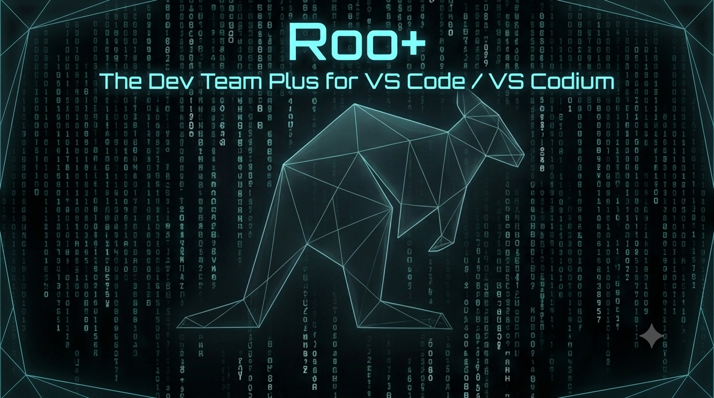

<div align="center">
  
</div>
<br/>

<p align="center">
  <a href="https://open-vsx.org/extension/xavier-arosemena/roo-plus">
    
  </a>
  <a href="https://github.com/xavier-arosemena/roo-plus/issues">
    
  </a>
  <a href="https://github.com/xavier-arosemena/roo-plus/blob/master/LICENSE">
    
  </a>
</p>

<br/>

<h1 align="center">🚀 Roo+</h1>
<h3 align="center">Your AI Development Team — 233 Specialized Agents — 90 Pre-Loaded</h3>

<br/>

<p align="center">
  Roo+ is a <strong>fork of <a href="https://github.com/Zoo-Code-Org/Zoo-Code">Zoo Code</a></strong> (originally forked from <a href="https://github.com/RooVeterinaryInc/roo-cline">Roo Code</a> / <a href="https://github.com/cline/cline">Cline</a>) — a powerful AI-powered development assistant that brings a whole team of AI agents right into your editor.
</p>

<br/>

## ✨ What is Roo+?

Roo+ extends the incredible foundation of Zoo Code with **90 custom modes** (curated from a total of 233 specialized agents available), **enhanced features**, and a personalized configuration tailored for modern development workflows.

| Feature                       | Description                                                     |
| ----------------------------- | --------------------------------------------------------------- |
| 🎯 **Custom Modes Library**   | **90 specialized agents** pre-loaded for every task             |
| 🤖 **AI Agent Team**          | Multiple AI agents working together in your editor              |
| 🔌 **MCP Support**            | Full Model Context Protocol integration                         |
| 🌍 **Multi-Provider**         | Works with Anthropic, OpenAI, Gemini, Ollama, and 25+ providers |
| 🛠️ **Terminal Integration**   | Smart terminal with shell integration                           |
| 📁 **Tree-Sitter Code Index** | Intelligent code understanding for 30+ languages                |
| 🔒 **Atomic File Writing**    | Safe, crash-proof file operations                               |
| 🌐 **Localization**           | Available in 18+ languages                                      |

<br/>

---

## 🎯 Custom Modes Library

Roo+ ships with **90 specialized AI agents** pre-configured and ready to use. Switch between them instantly to get expert-level assistance for any task.

> **💡 Tip:** Open the mode selector (bottom of the VS Code window) to browse and switch between all available agents.

### 🏢 For Organizations

| Category                  | Agents                                                              | Description                                                     |
| ------------------------- | ------------------------------------------------------------------- | --------------------------------------------------------------- |
| 📱 **Product Management** | Product Manager, Product Analytics Scientist                        | Roadmap planning, feature prioritization, data-driven decisions |
| 📊 **Business Analysis**  | Business Analyst, Data Analyst, Data Engineer                       | Requirements gathering, process improvement, data insights      |
| 📈 **Marketing**          | Marketing Strategist, Content Marketer, Growth Experimentation Lead | Campaign strategy, content creation, A/B testing                |
| 💼 **Sales**              | Sales Engineer                                                      | Technical pre-sales, solution architecture, proof of concepts   |
| 👥 **Customer Success**   | Customer Success Manager                                            | Customer retention, growth, advocacy                            |
| 📋 **Project Management** | Project Manager, Scrum Master                                       | Agile facilitation, sprint planning, team coordination          |
| ✍️ **Content & UX**       | Technical Writer, UX Researcher, Content Marketer                   | Documentation, user research, content strategy                  |
| 📊 **Business Tools**     | Excel Power User, PowerPoint Presenter                              | Spreadsheet analysis, presentation design                       |

### ⚖️ Legal & Compliance

| Category                              | Agents                                                                                                                                                                                           | Description                                                                                     |
| ------------------------------------- | ------------------------------------------------------------------------------------------------------------------------------------------------------------------------------------------------ | ----------------------------------------------------------------------------------------------- |
| 🇪🇺 **GDPR / EU / Multi-Jurisdiction** | Compliance Specialist                                                                                                                                                                            | Analyzes **GDPR, HIPAA, SOX**, and other regulatory frameworks with cross-jurisdiction coverage |
| 🇺🇸 **US Law**                         | Corporate Law, Criminal Law, Employment Law, Intellectual Property, Litigation Support, Compliance Specialist                                                                                    | Comprehensive US legal coverage                                                                 |
| 🇨🇦 **Canada Law**                     | Corporate Law (Canada), Criminal Law (Canada), Employment Law (Canada), Intellectual Property (Canada), Litigation Support (Canada), Compliance Auditor (Canada), Compliance Specialist (Canada) | Comprehensive Canadian legal coverage                                                           |
| 🔐 **Compliance Automation**          | Compliance Automation Engineer, OSS License Auditor, Policy-as-Code Auditor                                                                                                                      | Automated compliance enforcement                                                                |

### 🧠 SOTA 2026 Personas

Advanced reasoning personas implementing cutting-edge cognitive patterns:

| Tier                          | Personas                                                                  |
| ----------------------------- | ------------------------------------------------------------------------- |
| 🏛️ **Foundational Reasoning** | Core Reasoning Architect, Formula Cascade Oracle, Fractal Elaborator      |
| ⚡ **Engineering Excellence** | High-Performance Engineer, SOTA Stack Master, UI/UX Vibe Master           |
| 🛡️ **Quality & Integrity**    | Anti-Fiction Sentinel, DevOps Observability Sentinel                      |
| 🧩 **Problem-Solving**        | Problem Solving Maestro, Cognitive Multi-Thinker, Agentic Swarm Conductor |

### 🛠️ Developer Toolbox

| Category                       | Agents                                                                                                                                                                                      | Description                  |
| ------------------------------ | ------------------------------------------------------------------------------------------------------------------------------------------------------------------------------------------- | ---------------------------- |
| 💻 **Core Development**        | Full-Stack, Backend, Frontend, API Designer, Architect, Microservices, Electron, Deep Research Protocol                                                                                     | Foundation development roles |
| 💬 **Language Specialists**    | Python, TypeScript, Rust, Go, Java, C#, Kotlin, Swift, Angular, Vue, React, Next.js, C++, .NET, Flutter, Rails, Spring Boot, SQL                                                            | 18 language-specific experts |
| 🏗️ **Infrastructure & DevOps** | AWS, Azure, GCP, Kubernetes, Docker, Terraform, SRE, Platform Engineer, Network Engineer, Security Engineer, Deployment Engineer, DevOps Architect, Observability Architect, Chaos Engineer | Cloud-native infrastructure  |
| 🔐 **Security & Quality**      | Cybersecurity Expert, Penetration Tester, Security Auditor, Cloud Security Architect, Zero Trust Strategist, Secrets Auditor, Code Reviewer, Debugger, QA Expert, Tester (TDD)              | Security-first development   |
| 🧠 **AI & ML**                 | Machine Learning Engineer, AI System Architect, Data Scientist, MLOps Engineer, LLM Architect, NLP Specialist, Prompt Engineer, RAG Evaluator, Computer Vision Expert                       | AI/ML development            |

### 🔄 Meta-Orchestration

| Agent                   | Description                                    |
| ----------------------- | ---------------------------------------------- |
| Workflow Orchestrator   | Coordinate complex multi-step workflows        |
| Multi-Agent Coordinator | Manage inter-agent communication               |
| Task Distributor        | Intelligent work allocation and load balancing |
| Search Specialist       | Advanced information retrieval                 |
| Policy-as-Code Auditor  | Enforce policy gates on infrastructure         |

### 🎯 Specialized Domains

| Domain        | Agent                          |
| ------------- | ------------------------------ |
| 💰 Fintech    | Fintech Engineer               |
| ⛓️ Blockchain | Blockchain Developer           |
| 🎮 Gaming     | Game Developer                 |
| 📡 IoT        | IoT Engineer                   |
| 🔍 SEO        | SEO Strategist                 |
| 💳 Payments   | Payment Integration Specialist |
| 🎨 AI Art     | AI Art Director                |

### How to Use Custom Modes

**Switching modes:**

1. Click the **mode selector** at the bottom of VS Code (or press `Ctrl+Shift+P` → "Roo Code: Switch Mode")
2. Browse the **90 pre-loaded modes** by name
3. Select the agent that matches your current task
4. The agent activates with its specialized role definition and toolset

### Full Agent Catalog

Browse all **233 agents** with their slug, category, and pre-load status in the **[Agent Catalog](custom-modes/AGENT_CATALOG.md)**. Each entry shows:

- ✅ **Pre-loaded** — already available in the mode selector
- ⬜ **Available** — in the submodule, ready to import

### Adding More Agents (the remaining 143)

The custom modes library contains **233 available agents**. 90 are pre-loaded in [`.roomodes`](.roomodes); the remaining **143 are in the submodule** and can be added at any time.

**How [`custom-modes/manifest.json`](custom-modes/manifest.json) works:**

- `includeCategories` with `"all"` — includes EVERY agent from that category directory (e.g., `"business-product": "all"` adds all 15 business agents)
- `includeSlugs` — adds INDIVIDUAL agents by their slug name, regardless of category
- `excludeSlugs` — removes specific agents from the curated list

Currently **0 categories** are set to `"all"` — all curation is via individual slugs. **90 individual slugs** define the curated set.

**Option 0 — Install from the Mode Marketplace (easiest):**

The quickest way to add new modes is directly from the **Mode Marketplace** inside the extension's webview UI:

1. Click the **Mode Marketplace** button in the mode selector (bottom of the VS Code window) or the marketplace tab
2. Browse available modes — search by name, filter by tags, or sort by popularity
3. Click **Install** on any mode you want to add
4. Choose whether to install **globally** (available in all projects) or to the **current project**
5. The mode is immediately available in your mode selector — no reload needed

The marketplace also supports **MCP servers** and includes bundled modes from the curated 233-agent library.

**Option A — Add via manifest (recommended for multiple agents):**

1. Open the **[Agent Catalog](custom-modes/AGENT_CATALOG.md)** and find agents marked ⬜ Available
2. Note their `slug` (e.g., `seo-strategist`, `game-developer`)
3. Open [`custom-modes/manifest.json`](custom-modes/manifest.json) and add the slug(s) to `"includeSlugs"`
4. Run:
    ```bash
    pnpm run sync:custom-modes
    ```
5. Reload VS Code window

**Option B — Add an entire category:**
Check the **[Agent Catalog](custom-modes/AGENT_CATALOG.md)** to see which categories have many agents you want, then in [`custom-modes/manifest.json`](custom-modes/manifest.json) set that category to `"all"`:

```json
{
	"includeCategories": {
		"specialized-domains": "all",
		"meta-orchestration": "all"
	}
}
```

Then run `pnpm run sync:custom-modes`.

**Option C — Add one agent directly to `.roomodes`:**
Copy the agent YAML content from its file in [`custom-modes/agents/`](custom-modes/agents/), paste it into [`.roomodes`](.roomodes) under the `customModes:` array (keeping only `slug`, `name`, `roleDefinition`, `customInstructions`, `groups` fields), then reload VS Code.

<br/>

---

## 🚀 Quick Start

### Install from VS Codium Marketplace

1. Open **VS Code** or **VS Codium**
2. Go to **Extensions** (`Ctrl+Shift+X` / `Cmd+Shift+X`)
3. Search for **"Roo+"**
4. Click **Install**

Or install directly from the command line:

```bash
# Via the Open VSX CLI
ovsx install xavier-arosemena/roo-plus
```

### Install from VSIX

```bash
# Clone the repo
git clone https://github.com/xavier-arosemena/roo-plus.git
cd roo-plus

# Initialize submodules (includes the 233-agent custom modes library)
git submodule update --init --recursive

# Install dependencies
pnpm install

# Sync custom modes into .roomodes
pnpm run sync:custom-modes

# Build the VSIX
pnpm vsix

# The VSIX will be at: bin/roo-plus-3.68.0.vsix
```

<br/>

---

## 🏗️ Project Structure

```
roo-plus/
├── .roomodes                # 90 custom modes (auto-generated)
├── custom-modes/            # Git submodule: 233-agent library
│   ├── agents/              # Agent YAML files by category
│   ├── manifest.json        # Curation manifest
│   └── README-ROO-PLUS.md   # Submodule documentation
├── scripts/
│   └── sync-custom-modes.mjs # Custom modes conversion script
├── src/                     # Extension source
│   ├── api/                 # API provider integrations
│   ├── core/                # Core logic (task, config, webview)
│   ├── services/            # Services (MCP, terminal, auth, etc.)
│   ├── i18n/                # Internationalization
│   └── integrations/        # Editor integrations
├── webview-ui/              # React-based WebView UI
├── packages/                # Shared packages (types, core, IPC, etc.)
└── apps/                    # Applications (CLI, VS Code shim, e2e)
```

<br/>

---

## 🔄 Staying Updated

### From Zoo Code Upstream

Since Roo+ is a fork of Zoo Code, you can pull the latest security updates and features from upstream:

```bash
git fetch upstream
git merge upstream/main
```

### From Custom Modes Upstream

The **90 custom modes/agents** shipped with Roo+ are sourced from the [**Custom-Modes-Roo-Code**](https://github.com/jtgsystems/Custom-Modes-Roo-Code) repository by [**jtgsystems**](https://github.com/jtgsystems). A huge thank you to the original author for curating and maintaining this comprehensive agent library — this project would not exist without that foundation.

> **📌 Attribution**: [`github.com/jtgsystems/Custom-Modes-Roo-Code`](https://github.com/jtgsystems/Custom-Modes-Roo-Code)

The library is independently versioned via git submodule:

```bash
# Pull latest agents and regenerate .roomodes
pnpm run custom-modes:update

# Or manually:
cd custom-modes && git checkout main && git pull origin main && cd ..
pnpm run sync:custom-modes
```

<br/>

---

## 🤝 Contributing

Contributions, issues, and feature requests are welcome!

- 🐛 **Report a bug**: [Open an issue](https://github.com/xavier-arosemena/roo-plus/issues/new?template=bug_report.md)
- 💡 **Suggest a feature**: [Open a discussion](https://github.com/xavier-arosemena/roo-plus/discussions)
- 🔀 **Submit a PR**: Fork the repo and create a pull request
- 🎯 **Add a custom mode agent**: Improve the agent library at [`custom-modes/`](custom-modes/) and submit a PR upstream

<br/>

---

## 📜 License

This project is licensed under the **Apache 2.0 License** — see the [LICENSE](LICENSE) file for details.

<br/>

---

<p align="center">
  <sub>Built with ❤️ by <a href="https://github.com/xavier-arosemena">Xavier Arosemena</a> (<a href="https://github.com/Audare-est-Facere">Audare est Facere</a>)</sub>
  <br/>
  <sub>Roo+ is not affiliated with Zoo Code, Roo Code, or Cline.</sub>
</p>
