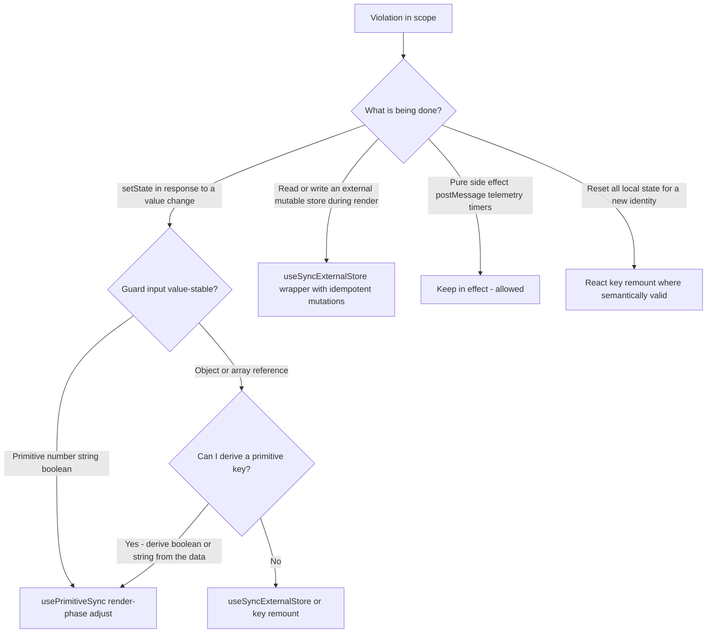

# Loop-safe react-hooks v7 fixes for App.tsx & ChatView.tsx (React 18.3.1)

**Status:** Design (no code changes — this is the spec for a follow-up implementation task)
**Scope:** `webview-ui/src/App.tsx` + `webview-ui/src/components/chat/ChatView.tsx` only.
**Goal:** Fix the 9 react-hooks v7 violations reintroduced by the hotfix revert, without reintroducing the render-phase setState pattern that caused deployment issue #245 (React error #301, "Too many re-renders") in v3.81.0-pre-release.4.

---

## 1. Verified constraints (ground truth in this repo)

| Constraint             | Verified value                                                                                                                            | Evidence                                                                        |
| ---------------------- | ----------------------------------------------------------------------------------------------------------------------------------------- | ------------------------------------------------------------------------------- |
| React runtime          | `react`/`react-dom` `^18.3.1`                                                                                                             | [`webview-ui/package.json`](webview-ui/package.json:61)                         |
| React Compiler         | `babel-plugin-react-compiler` with `{ target: "18" }`                                                                                     | [`webview-ui/vite.config.ts`](webview-ui/vite.config.ts:89)                     |
| Lint plugin            | `eslint-plugin-react-hooks` **7.1.1**                                                                                                     | [`packages/config-eslint/package.json`](packages/config-eslint/package.json:16) |
| Rule set               | `pluginReactHooks.configs.recommended.rules` (enables `set-state-in-effect`, `refs`, `immutability`, `rules-of-hooks`, `exhaustive-deps`) | [`packages/config-eslint/react.js`](packages/config-eslint/react.js:33)         |
| Suppressions           | `webview-ui/eslint-suppressions.json` is `{}` — zero suppressions, must stay zero                                                         | [`webview-ui/eslint-suppressions.json`](webview-ui/eslint-suppressions.json:1)  |
| `useSyncExternalStore` | Available (added in React 18.0) — usable here                                                                                             | React 18.3.1                                                                    |

Because `useEffectEvent` (React 19.2+) is not available on React 18.3.1, we need a React-18-native toolkit. Section 3 defines it; section 4 applies it.

---

## 2. Root-cause analysis of #301 — why f8505866f's approach crashed

Commit `f8505866f` "solved" the lint errors by moving `setState` out of effects into the render phase using the "adjust state during render" pattern. That pattern is **safe only when the guard converges**. The crash instances shared one or both of these properties:

### 2.1 Reference-instability of the guard input

The canonical safe pattern is:

```tsx
if (prev !== current) {
	setPrev(current) // ← makes the guard false on the very next render
	// ...setState...
}
```

This converges only if `current !== prev` becomes `false` after `setPrev`. It **does not converge** when `current` is an **object/array reference that is recreated on every render**. In this codebase:

- Context state is a single `useState` object in `ExtensionStateContext`; every `setState` there recreates the whole object, so **every value read from `useExtensionState()` is a fresh reference on every render** unless it is memoized. Guards written as `if (prevObject !== currentObject)` therefore evaluate `true` on every render → render-phase `setState` → re-render → new reference → `true` again → **infinite loop → React error #301**.
- `useMemo` outputs are only stable when their **inputs** are stable. A guard comparing a memoized value (e.g. `task = useMemo(() => messages.at(0), [messages])`) is stable only if `messages` is reference-stable; `messages` comes from context, so it is not. The chain `state → memo → guard → setState → state` is a feedback loop.

### 2.2 Why some instances are provably safe

The same pattern **is** safe when the guard compares **primitives** (`number` / `string` / `boolean`). Primitives are compared by value, not identity:

- `messages.length` is a number — stable for the same logical content even when the array reference changes.
- `task?.ts` is a number — stable for the same task.
- `apiConfiguration?.apiProvider` is a string — stable for the same provider.
- `shouldShowAnnouncement` is a boolean — stable for the same logical value.
- A boolean derived from an array via `.some(...)` is stable for the same logical content.

**Rule of thumb for this design:** _render-phase "adjust state during render" is permitted only when the guard is a primitive comparison of a value that is value-stable across unrelated re-renders, and the guard itself is written into state (or the compared state) in the same render pass so it flips to `false`._ Everything else uses `useSyncExternalStore` or an effect.

### 2.3 Why the effects were not the problem

Calling `setState` in `useEffect` is not loop-prone (effects run once per dep change, post-commit). The hotfix's bug was specifically the **render-phase** conversion, not the effects themselves. The goal here is to get lint-clean **without** moving the dangerous cases into render phase, and to keep the safe cases in render phase with provably convergent guards.

---

## 3. Reusable toolkit (React-18 native)

### 3.1 `usePrimitiveSync` — render-phase sync with a provably convergent primitive guard

A generic, lint-clean replacement for the "setState in response to a prop/context change" effect, restricted to **primitive** triggers.

**New file:** `webview-ui/src/hooks/usePrimitiveSync.ts`

```tsx
import { useState } from "react"

/**
 * React-18 + react-hooks v7 + React Compiler safe "sync state when a
 * primitive input changes" hook.
 *
 * Replaces `useEffect(() => { setState(...) }, [trigger])` which trips
 * `react-hooks/set-state-in-effect`.
 *
 * Convergence: `trigger` MUST be a primitive (number | string | boolean |
 * null | undefined) whose value is stable across unrelated re-renders.
 * When it changes, we write the new value into state in the SAME render
 * pass, so the `trigger !== prevTrigger` guard is false on the very next
 * render. There is no feedback loop because the guard input is value-stable.
 *
 * The `onTriggerChange` callback must be pure except for calling setState
 * on this same component (the React-endorsed "adjust state during render"
 * contract). Do NOT postMessage / mutate refs / run timers in it.
 */
export function usePrimitiveSync<T extends string | number | boolean | null | undefined>(
	trigger: T,
	onTriggerChange: (prev: T, next: T) => void,
): void {
	const [prevTrigger, setPrevTrigger] = useState<T>(trigger)

	if (trigger !== prevTrigger) {
		setPrevTrigger(trigger)
		onTriggerChange(prevTrigger, trigger)
	}
}
```

**Why lint-clean:** no `setState` lives inside any `useEffect` (no `set-state-in-effect`); no refs are read during render (no `refs`); the compiler supports the adjust-during-render pattern natively.

**Why loop-safe:** `trigger` is a value-stable primitive, `prevTrigger` is state that is set to `trigger` in the same pass, so `trigger !== prevTrigger` can only be true once per logical change. Unrelated re-renders with the same logical trigger produce `false`.

### 3.2 `useStableCallback` — a React-18 `useEffectEvent` equivalent (assessment)

`useEffectEvent` solves "effects reading stale values" by giving effects a stable callback that always sees the latest render values. We can build an equivalent on React 18:

**New file:** `webview-ui/src/hooks/useStableCallback.ts`

```tsx
import { useCallback, useEffect, useRef } from "react"

/**
 * React-18 equivalent of React 19's useEffectEvent: returns a stable
 * function that always invokes the latest `callback` closure.
 * The ref is only READ inside the returned callback (an event/effect
 * handler, not during render), so it does not trip `react-hooks/refs`.
 */
export function useStableCallback<Args extends unknown[], R>(callback: (...args: Args) => R): (...args: Args) => R {
	const latestRef = useRef(callback)
	useEffect(() => {
		latestRef.current = callback
	}, [callback])
	return useCallback((...args: Args) => latestRef.current(...args), [])
}
```

**Assessment — does it satisfy the linter?** It keeps `setState` calls out of _direct_ effect bodies, and the v7 `set-state-in-effect` rule does not trace through arbitrary function definitions, so `stableCb()` called from an effect is very likely not flagged. **However**, it is semantically identical to setState-in-effect (the state is still set synchronously in the effect, just one call removed), it is fragile against future rule versions, and the React Compiler still sees through it. **Recommendation:** use `useStableCallback` only for **non-setState side effects** that need fresh values from an effect (e.g. `postMessage`, telemetry, timers) — where it genuinely replaces the `useEffectEvent` use case. Do **not** use it to smuggle `setState` out of effects; use `usePrimitiveSync` or `useSyncExternalStore` instead.

### 3.3 `createSeenTsStore` — a `useSyncExternalStore` external store for the seen-set

The React-endorsed answer to "read an external mutable store during render without a ref" is `useSyncExternalStore`. The store keeps the existing `LRUCache` (bounded memory: `max: 100`, `ttl: 5 min`, plus the existing 60 s prune) and exposes **idempotent** mutations that only notify when something actually changed — this is what guarantees convergence.

**New file:** `webview-ui/src/utils/seenTsStore.ts`

```tsx
import { LRUCache } from "lru-cache"

export interface SeenTsStore {
	getSnapshot: () => number
	subscribe: (onStoreChange: () => void) => () => void
	has: (ts: number) => boolean
	add: (ts: number) => void
	clear: () => void
	/** Delete every key not present in `keep`. */
	prune: (keep: ReadonlySet<number>) => void
}

export function createSeenTsStore(max = 100, ttlMs = 1000 * 60 * 5): SeenTsStore {
	const cache = new LRUCache<number, true>({ max, ttl: ttlMs })
	let version = 0
	const listeners = new Set<() => void>()

	const emit = () => {
		version += 1
		listeners.forEach((listener) => listener())
	}

	return {
		getSnapshot: () => version,
		subscribe: (listener) => {
			listeners.add(listener)
			return () => {
				listeners.delete(listener)
			}
		},
		has: (ts) => cache.has(ts),
		add: (ts) => {
			// Idempotent: no-op + no notify when already present. This is what
			// prevents a render loop when an effect re-adds viewport timestamps.
			if (!cache.has(ts)) {
				cache.set(ts, true)
				emit()
			}
		},
		clear: () => {
			if (cache.size > 0) {
				cache.clear()
				emit()
			}
		},
		prune: (keep) => {
			let changed = false
			for (const key of cache.keys()) {
				if (!keep.has(key)) {
					cache.delete(key)
					changed = true
				}
			}
			if (changed) {
				emit()
			}
		},
	}
}
```

**Convergence argument:** every mutation is idempotent and only `emit()`s on an actual change, and `getSnapshot` returns a monotonically increasing integer (stable between mutations, `Object.is`-equal across renders that observe no change). A render caused by a snapshot bump reads a consistent store state; re-running the same effect re-adds the same keys, which are now present → no notify → no further render. There is **no render-phase write** to the store, so there is no `state → memo → guard → state` feedback loop.

---

## 4. Per-violation analysis (all 9)

Legend: **P** = pattern used, **Why safe** = convergence argument, **Lint** = why the rule is satisfied.

### V1 — App.tsx:179 `setShowAnnouncement(true)` (announcement)

Current code ([`webview-ui/src/App.tsx`](webview-ui/src/App.tsx:177)):

```tsx
useEffect(() => {
	if (shouldShowAnnouncement && tab === "chat") {
		setShowAnnouncement(true)
		vscode.postMessage({ type: "didShowAnnouncement" })
	}
}, [shouldShowAnnouncement, tab])
```

**P:** Render-phase adjust with two primitive boolean guards + "handled this episode" state; the `postMessage` (a pure side effect, no setState) stays in an effect.

```tsx
const shouldShow = shouldShowAnnouncement && tab === "chat"

// episode = the window during which shouldShowAnnouncement is true.
// announcementHandled=false → not yet shown this episode.
const [announcementHandled, setAnnouncementHandled] = useState(false)

// Render-phase adjustment — primitive boolean guards only.
if (shouldShow && !showAnnouncement && !announcementHandled) {
	setShowAnnouncement(true)
	setAnnouncementHandled(true)
}
if (!shouldShowAnnouncement && announcementHandled) {
	setAnnouncementHandled(false) // re-arm for the next episode
}

// Pure side effect, no setState → stays in an effect, lint-clean.
useEffect(() => {
	if (shouldShow) {
		vscode.postMessage({ type: "didShowAnnouncement" })
	}
}, [shouldShow])
```

**Why safe / loop-proof:**

- Shown once per episode, **including at mount** (matches the current effect, which always runs once). Guards are booleans; each `setState` flips its own guard to `false` in the same pass.
- **Dismissible with no immediate re-show:** dismissal sets `showAnnouncement=false`; if `shouldShowAnnouncement` is still `true` (the `didShowAnnouncement` extension round-trip is async), the first guard is suppressed by `announcementHandled === true`. This fixes the "announcement not dismissible" failure mode that a naive render-phase conversion would introduce.
- A new episode (extension sets `shouldShowAnnouncement` `true` again after `false`) re-arms `announcementHandled` and re-shows, and re-posts once.
- The effect depends only on the value-stable boolean `shouldShow`; it posts exactly once per episode, never re-posts on unrelated re-renders.

**Lint:** no `setState` in any effect (`set-state-in-effect` clean); no ref reads (`refs` clean); `exhaustive-deps` satisfied (`shouldShow` is in deps).

### V2 — App.tsx:190 `setCurrentSection` / `setCurrentMarketplaceTab` / `setTab` (settings import)

Current code ([`webview-ui/src/App.tsx`](webview-ui/src/App.tsx:184)):

```tsx
useEffect(() => {
	const isRecoverableTab = tab === "settings" || tab === "marketplace"
	if (showWelcome && settingsImportedAt && settingsImportedAt !== handledImportRef.current) {
		handledImportRef.current = settingsImportedAt
		if (!isRecoverableTab) {
			setCurrentSection("providers")
			setCurrentMarketplaceTab(undefined)
			setTab("settings")
		}
	}
}, [showWelcome, settingsImportedAt, tab])
```

**P:** Render-phase adjust via `usePrimitiveSync` with the **number** `settingsImportedAt` as the trigger; the "already handled this timestamp" bookkeeping moves from a ref to state (the `handledImportRef` ref is deleted).

```tsx
const handledImportAt = ... // local state replacing handledImportRef
// const [handledImportAt, setHandledImportAt] = useState<number | undefined>(undefined)

usePrimitiveSync(settingsImportedAt, (_prev, next) => {
  if (showWelcome && next !== undefined) {
    const isRecoverableTab = tab === "settings" || tab === "marketplace"
    if (!isRecoverableTab) {
      setCurrentSection("providers")
      setCurrentMarketplaceTab(undefined)
      setTab("settings")
    }
  }
})
```

(`usePrimitiveSync` internally does `setHandledImportAt(next)` in the same render pass, replacing the ref write. Alternatively inline the pattern if a single hook usage reads cleaner.)

**Why safe:** `settingsImportedAt` is a **number** (a timestamp) — value-stable; the guard compares numbers. After the first change it is written to state in the same pass, so it never re-fires. Re-renders caused by unrelated context churn (fresh object references) do not re-trigger because the number is unchanged. The `isRecoverableTab` case (already on settings/marketplace) is consumed without navigating, and never re-navigates later — matches the three existing tests in [`webview-ui/src/__tests__/App.spec.tsx`](webview-ui/src/__tests__/App.spec.tsx:281) (`redirects…`, `consumes…without a later redirect`, `does not bounce back…`).

**Lint:** `set-state-in-effect` clean (no setState in effects); the effect is gone entirely.

### V3 — ChatView.tsx:105 `setShowRetiredProviderWarning(false)` (provider change)

Current code ([`webview-ui/src/components/chat/ChatView.tsx`](webview-ui/src/components/chat/ChatView.tsx:103)):

```tsx
const providerName = apiConfiguration?.apiProvider
useEffect(() => {
	setShowRetiredProviderWarning(false)
}, [providerName])
```

**P:** Render-phase adjust with a string guard via `usePrimitiveSync`.

```tsx
const providerName = apiConfiguration?.apiProvider

usePrimitiveSync(providerName, () => {
	setShowRetiredProviderWarning(false)
})
```

**Why safe:** `providerName` is a **string primitive**; `apiConfiguration` may be a fresh object every render but the string value is stable. The guard flips to `false` in the same pass. This is the canonical, provably-safe instance of the pattern.

**Lint:** clean (no effect).

### V4 — ChatView.tsx:496 `setPrimaryButtonText` / `setSecondaryButtonText` (resume_task completion)

Current code ([`webview-ui/src/components/chat/ChatView.tsx`](webview-ui/src/components/chat/ChatView.tsx:490)):

```tsx
useEffect(() => {
	if (clineAsk === "resume_task" && currentTaskItem?.parentTaskId) {
		const hasCompletionResult = messages.some(
			(msg) => msg.ask === "completion_result" || msg.say === "completion_result",
		)
		if (hasCompletionResult) {
			setPrimaryButtonText(t("chat:startNewTask.title"))
			setSecondaryButtonText(undefined)
		}
	}
}, [clineAsk, currentTaskItem?.parentTaskId, messages, t])
```

**P:** Render-phase adjust, but the guard must be a **derived primitive** — never the `messages` array reference. Fold the condition into a single string primitive ("apply" / "idle") and sync on that.

```tsx
const resumeTaskApply: "apply" | "idle" =
	clineAsk === "resume_task" && !!currentTaskItem?.parentTaskId && hasCompletionResult ? "apply" : "idle"

usePrimitiveSync(resumeTaskApply, (prev, next) => {
	if (next === "apply" && prev !== "apply") {
		setPrimaryButtonText(t("chat:startNewTask.title"))
		setSecondaryButtonText(undefined)
	}
})
```

where `hasCompletionResult` is the existing `messages.some(...)` expression hoisted above (a **boolean** — value-stable across re-renders for the same logical message content).

**Why safe:** the guard compares a derived **string primitive**. Even though `messages` and `currentTaskItem` are reference-unstable, the derived string is value-stable; unrelated re-renders cannot flip it. This is the exact class of fix that avoids the `messages`-by-reference guard that f8505866f would have produced (which loops: fresh `messages` → guard true → setState → re-render → fresh `messages` → …).

**Lint:** clean; `t` (i18next) no longer needs to be an effect dep.

### V5 — ChatView.tsx:504 input/button reset when messages cleared

Current code ([`webview-ui/src/components/chat/ChatView.tsx`](webview-ui/src/components/chat/ChatView.tsx:502)):

```tsx
useEffect(() => {
	if (messages.length === 0) {
		setSendingDisabled(false)
		setClineAsk(undefined)
		setEnableButtons(false)
		setPrimaryButtonText(undefined)
		setSecondaryButtonText(undefined)
	}
}, [messages.length])
```

**P:** Render-phase adjust with a boolean guard derived from `messages.length` (a number).

```tsx
const [prevMessagesEmpty, setPrevMessagesEmpty] = useState(messages.length === 0)

if (messages.length === 0 && !prevMessagesEmpty) {
	setPrevMessagesEmpty(true)
	setSendingDisabled(false)
	setClineAsk(undefined)
	setEnableButtons(false)
	setPrimaryButtonText(undefined)
	setSecondaryButtonText(undefined)
}
if (messages.length !== 0 && prevMessagesEmpty) {
	setPrevMessagesEmpty(false) // re-arm for a future clear
}
```

**Why safe:** `messages.length` is a number; `prevMessagesEmpty` is a boolean state. Each `setState` flips its own guard in the same pass. No reference comparison.

**Lint:** clean (no effect).

### V6 — ChatView.tsx:515 UI state resets on task switch

Current code ([`webview-ui/src/components/chat/ChatView.tsx`](webview-ui/src/components/chat/ChatView.tsx:514)):

```tsx
useEffect(() => {
	setExpandedRows({})
	everVisibleMessagesTsRef.current.clear()
	setCurrentFollowUpTs(null)
	setIsCondensing(false)
	if (autoApproveTimeoutRef.current) {
		clearTimeout(autoApproveTimeoutRef.current)
		autoApproveTimeoutRef.current = null
	}
	userRespondedRef.current = false
}, [task?.ts])
```

**P:** **Split by kind.** The React-state resets move to render phase keyed on the **primitive** `task?.ts`; the ref mutations and timer teardown stay in an effect (ref writes and `clearTimeout` in effects are perfectly legal and lint-clean — only `setState` is banned there).

```tsx
const taskTs = task?.ts
const [prevTaskTs, setPrevTaskTs] = useState(taskTs)

if (taskTs !== prevTaskTs) {
	setPrevTaskTs(taskTs)
	setExpandedRows({})
	setCurrentFollowUpTs(null)
	setIsCondensing(false)
}

// No setState here — refs/timers only, so it is NOT a set-state-in-effect.
useEffect(() => {
	seenTsStore.clear() // V8/V9 replaces everVisibleMessagesTsRef.current.clear()
	if (autoApproveTimeoutRef.current) {
		clearTimeout(autoApproveTimeoutRef.current)
		autoApproveTimeoutRef.current = null
	}
	userRespondedRef.current = false
}, [taskTs, seenTsStore])
```

**Why safe:** the render-phase guard compares `taskTs` (a **number**) to `prevTaskTs` state and writes it in the same pass — convergent. The effect keyed on `[taskTs]` runs once per task change and touches only refs/timers.

**Lint:** `set-state-in-effect` clean (the effect has zero `setState`); `refs` clean (refs are only written in effects / read in handlers, never read to render).

### V7 — ChatView.tsx:1383 `setCheckpointWarning` clear

Current code ([`webview-ui/src/components/chat/ChatView.tsx`](webview-ui/src/components/chat/ChatView.tsx:1380)):

```tsx
useEffect(() => {
	if (isHidden || !task) {
		setCheckpointWarning(undefined)
	}
}, [modifiedMessages.length, isStreaming, isHidden, task])
```

**P:** Render-phase adjust with a boolean guard. Note `modifiedMessages.length` and `isStreaming` in the original deps are over-broad (they only forced re-checks); the actual condition is `isHidden || !task`, both booleans.

```tsx
const shouldClearCheckpoint = isHidden || !task
const [prevShouldClearCheckpoint, setPrevShouldClearCheckpoint] = useState(shouldClearCheckpoint)

if (shouldClearCheckpoint !== prevShouldClearCheckpoint) {
	setPrevShouldClearCheckpoint(shouldClearCheckpoint)
	if (shouldClearCheckpoint) {
		setCheckpointWarning(undefined)
	}
}
```

**Why safe:** guard compares two **booleans**; `!task` is a boolean that is value-stable even when `task` is a fresh object reference (truthiness is stable). Converges after one pass; re-arms when the condition returns to `false`.

**Lint:** clean (no effect).

### V8 — ChatView.tsx:1033 `everVisibleMessagesTsRef.current.has(...)` in the `visibleMessages` filter

### V9 — ChatView.tsx:1089 `everVisibleMessagesTsRef.current.set(...)` while computing the viewport

Current code ([`webview-ui/src/components/chat/ChatView.tsx`](webview-ui/src/components/chat/ChatView.tsx:999), read at 1033, write at 1089, `LRUCache` defined at 184):

```tsx
const everVisibleMessagesTsRef = useRef<LRUCache<number, boolean>>(new LRUCache({ max: 100, ttl: 1000 * 60 * 5 }))
// in the visibleMessages useMemo (deps: [modifiedMessages]):
//   if (everVisibleMessagesTsRef.current.has(message.ts)) { ... }
//   ...
//   newVisibleMessages.slice(viewportStart).forEach((msg) => everVisibleMessagesTsRef.current.set(msg.ts, true))
```

**P:** Replace the ref with the `createSeenTsStore` external store (section 3.3) + `useSyncExternalStore`. Reads happen during render via `store.has(...)` (allowed — it is a store, not a ref); **writes move into an effect** (idempotent → no loop).

```tsx
import { useSyncExternalStore, useState } from "react"

// Stable identity via lazy useState init (not a ref → no `refs` violation).
const [seenTsStore] = useState(() => createSeenTsStore())
const _seenVersion = useSyncExternalStore(seenTsStore.subscribe, seenTsStore.getSnapshot)

const visibleMessages = useMemo(() => {
	// ...existing filter logic unchanged, except:
	//   if (seenTsStore.has(message.ts)) { ... }
	// (viewport computation and the trailing write are REMOVED from the memo)
	return newVisibleMessages
}, [modifiedMessages, _seenVersion])

// The viewport write moves here — after commit, not during render.
useEffect(() => {
	const viewportStart = Math.max(0, visibleMessages.length - 100)
	visibleMessages.slice(viewportStart).forEach((msg) => seenTsStore.add(msg.ts))
}, [visibleMessages, seenTsStore])

// Existing 60s prune, now via the store's idempotent prune.
useEffect(() => {
	const cleanupInterval = setInterval(() => {
		const currentMessageIds = new Set(modifiedMessages.map((m) => m.ts))
		const viewportMessageIds = new Set(
			visibleMessages.slice(Math.max(0, visibleMessages.length - 100)).map((m) => m.ts),
		)
		const keep = new Set([...currentMessageIds, ...viewportMessageIds])
		seenTsStore.prune(keep)
	}, 60000)
	return () => clearInterval(cleanupInterval)
}, [modifiedMessages, visibleMessages, seenTsStore])
```

Other call sites updated to the same store:

- Task-switch reset (V6 effect) and the `isHidden` effect ([`ChatView.tsx`](webview-ui/src/components/chat/ChatView.tsx:539)) and the unmount cleanup ([`ChatView.tsx`](webview-ui/src/components/chat/ChatView.tsx:545)) all call `seenTsStore.clear()`.

**Why safe / loop-proof:**

- The filter reads the store during render (pure, `useSyncExternalStore` sanctioned); the memo now also depends on `_seenVersion` (a number) so it recomputes when the store changes.
- Writes are **idempotent** and happen only in effects. Re-adding the same viewport timestamps is a no-op (no notify, no re-render). The `prune`/`clear` only notify on an actual change.
- Because a store mutation can only ever _hide_ additional messages (the filter is monotonic with respect to store growth), any re-render cascade is bounded by the message count and terminates — and in practice it is one extra render per mutation, identical to today's one-render-lag semantics (the current code writes during render N, visible at render N+1; we write after commit of N, visible at N+1).
- Memory stays bounded: same `LRUCache` (`max: 100`, `ttl: 5 min`) plus the 60 s prune.

**Lint:** `refs` clean — `everVisibleMessagesTsRef` is deleted entirely; no `ref.current` is read during render. `set-state-in-effect` clean — the store mutations are not React `setState`. `_seenVersion` uses the `^_` `varsIgnorePattern` so it is not an unused-var error ([`webview-ui/eslint.config.mjs`](webview-ui/eslint.config.mjs:8)).

**Compiler note:** `useSyncExternalStore` is first-class in React Compiler. The store is created via `useState` lazy init (stable identity) and mutated only through its own methods from effects — the documented external-store pattern.

---

## 5. Pattern-selection decision flow



---

## 6. Implementation plan (ordered steps)

1. **Add the toolkit.**
    - Create [`webview-ui/src/hooks/usePrimitiveSync.ts`](webview-ui/src/hooks/usePrimitiveSync.ts) (3.1).
    - Create [`webview-ui/src/hooks/useStableCallback.ts`](webview-ui/src/hooks/useStableCallback.ts) (3.2) — only if the implementation needs an effect-side-effect with fresh values; otherwise defer.
    - Create [`webview-ui/src/utils/seenTsStore.ts`](webview-ui/src/utils/seenTsStore.ts) (3.3) with unit tests (idempotent `add`, `prune`, `clear`, notify-once semantics, `getSnapshot` stability).

2. **ChatView — seen-set (V8/V9) first.** This is the riskiest change; land it alone so the refs violations are provably gone:
    - Replace `everVisibleMessagesTsRef` with the store + `useSyncExternalStore`.
    - Move the viewport write into an effect; update the filter read.
    - Rewire prune interval, task-switch clear, hidden clear, and unmount clear to the store.
    - Update `visibleMessages` memo deps to `[modifiedMessages, _seenVersion]`.

3. **ChatView — simple primitive guards (V3, V5, V7).** Retired-provider warning, messages-cleared reset, checkpoint-warning clear.

4. **ChatView — composite primitive guards (V4, V6).** `resumeTaskApply` derived-string sync; task-switch split (render-phase state resets + ref/timer cleanup effect).

5. **App — V1 announcement + V2 settings import.** Implement the episode-guard announcement (with the dismissible fix) and the `settingsImportedAt` primitive sync; delete `handledImportRef`.

6. **Tests.** Add/update per section 7 (regression tests for #301 and announcement-dismissible).

7. **Verification gates (non-negotiable):**
    - `pnpm --dir webview-ui exec eslint src --ext=ts,tsx --max-warnings=0` → zero errors, and `webview-ui/eslint-suppressions.json` still `{}` (run with `--prune-suppressions` per the repo rule; confirm the count for touched files did not increase).
    - `pnpm --dir webview-ui exec tsc -b` (check-types).
    - `cd webview-ui && npx vitest run src` — all unit + integration tests pass.
    - Manual smoke: extension startup on chat tab with `shouldShowAnnouncement=true`, dismiss the announcement, verify no re-show and no "Too many re-renders".

8. **Roll out to the remaining ~25 files** using section 8's taxonomy.

---

## 7. Test plan

### 7.1 Regression tests that would have caught #301 ("Too many re-renders")

1. **Render-count bound under reference-unstable context churn** (App + ChatView). Render the component, then pump many consecutive context updates that change **no logical value** (fresh object references for `messages`/`extensionState` with identical content), each wrapped in `act`. Assert:
    - no `console.error` about "Maximum update depth exceeded" / "Too many re-renders" (mock/spy `console.error`);
    - the component renders a bounded number of times (e.g. spy on the component or assert a stable snapshot identity) — i.e. unrelated re-renders do not cascade.
      This is the exact failure mode of f8505866f (a guard comparing a fresh reference) and would have failed against the old code.

2. **Resume-task completion arrives → button text set exactly once, no loop.** Simulate a `completion_result` arriving for a `resume_task` subtask while the context keeps re-emitting `messages` with fresh references; assert the button text is applied and the render count stays bounded.

3. **Messages cleared → resets applied once, no loop.** Pump `messages` transitions empty↔non-empty and assert stable renders.

4. **Seen-set churn does not loop.** Render a ChatView with a large message list where the last 100 entries contain `api_req_finished`/`resume_task` messages; assert the filter converges (hidden once processed) and no "Maximum update depth exceeded".

### 7.2 Regression tests for the "announcement not dismissible" bug

5. **Shows once when `shouldShowAnnouncement && tab === "chat"` at mount** (App). Assert the announcement renders and `didShowAnnouncement` is posted exactly once.

6. **Dismissal is permanent for the current episode even while the extension flag is still `true`** (App). Set `shouldShowAnnouncement=true`, dismiss, then re-render with the flag **still true** (simulating the async round-trip); assert the announcement does **not** reappear.

7. **Re-shows on a new episode** (App). After the flag flips `false` then `true` again, assert it reappears and posts once more.

8. **Settings import** — keep the three existing tests green ([`webview-ui/src/__tests__/App.spec.tsx`](webview-ui/src/__tests__/App.spec.tsx:281)) and add: "no re-navigation on unrelated context updates after the import was consumed".

### 7.3 Unit tests for the toolkit and per-violation behavior

9. `createSeenTsStore` unit tests: `add` idempotency (second add does not notify / does not bump snapshot), `prune` only deletes non-kept keys and notifies once, `clear` notify-once, `getSnapshot` stable between mutations.

10. `usePrimitiveSync` unit tests: fires only on primitive change, does not fire on unrelated re-renders with the same trigger, converges (render count does not grow).

11. ChatView behavior tests: provider change clears the retired-provider warning; task-switch resets expanded rows / follow-up / condensing and clears the seen-set; checkpoint warning clears when hidden or no task.

### 7.4 Test-layer guidance (per repo AGENTS.md)

Put pure store/hook logic tests in package-local unit tests (`webview-ui` vitest); the App announcement/import and ChatView behavior tests as React component tests under `webview-ui/src` (testing-library). No `apps/vscode-e2e` needed unless the extension-host round-trip is required to reproduce.

---

## 8. Rollout to the remaining ~25 files converted by f8505866f

The same taxonomy applies to every other file that commit touched. For each converted file:

1. **Classify each violation by guard source:**
    - Value-stable **primitive** trigger → `usePrimitiveSync` render-phase adjust (safe class).
    - **Object/array** trigger where a primitive key can be derived (a `.length`, `.ts`, a `.some(...)` boolean, a composite string key) → derive the primitive, then `usePrimitiveSync`.
    - **External mutable store** (LRU caches, Maps/Sets held in refs, anything read during render) → `createSeenTsStore`-style `useSyncExternalStore` wrapper with idempotent mutations in effects.
    - **Pure side effects** (postMessage, telemetry, audio, timers) → keep in effects as-is (never banned).
    - **Reset-all-local-state on identity change** (e.g. switching a task/workspace where every piece of local state must reset) → prefer a React `key` remount on the subtree when semantically valid and cheap; this is the cleanest, inherently loop-free reset and avoids N render-phase setState calls.

2. **Never** write a render-phase guard that compares a context value, prop object, array, or `useMemo` output **by reference**; never feed a render-phase `setState` result back into the guard input through a memo.

3. **Keep pure side effects out of render-phase callbacks** (the `usePrimitiveSync` `onTriggerChange` must only call `setState`).

4. Re-run the section 6.7 gates per file; do not add suppressions.

---

## 9. Risks & open questions for the implementer

1. **`react-hooks/immutability` vs. the state-held store.** The `createSeenTsStore` instance is created via `useState` lazy init and mutated through its own methods in effects. The v7 `immutability` rule (if it flags cross-function method calls on a state value — it should not, since the mutation is opaque) is the one open lint risk. Gate: step 7 must confirm zero violations. Fallback if flagged: keep the `LRUCache` in a `useRef` (mutation-exempt) for the data, and hold only the version counter in the store object — or move the store to a module-scoped factory with per-instance reset in the unmount effect (both keep the same idempotent-notify contract).
2. **`_seenVersion` naming** relies on the `^_` `varsIgnorePattern` in [`webview-ui/eslint.config.mjs`](webview-ui/eslint.config.mjs:8) — confirmed present.
3. **The one-render-lag of the seen-set** is preserved from today's behavior (write during render N, read at N+1 → write after commit of N, read at N+1). No behavior change is expected, but the ChatView seen-set tests in section 7.1.4 should confirm.
4. **`useEvent` from `react-use`** ([`webview-ui/src/App.tsx`](webview-ui/src/App.tsx:2)) is an event-listener helper, not an effect body that calls setState — unaffected by this design.

---

## 10. Implementation status & notes (verified against the real repo)

All 9 violations are fixed in [`webview-ui/src/App.tsx`](webview-ui/src/App.tsx) and [`webview-ui/src/components/chat/ChatView.tsx`](webview-ui/src/components/chat/ChatView.tsx). Both files pass `eslint --max-warnings=0` and `webview-ui/eslint-suppressions.json` remains `{}`.

### 10.1 Rule-behavior findings that refined the design

- **`react-hooks/set-state-in-render` exists and is `error` in the recommended config** (verified in `eslint-plugin-react-hooks@7.1.1`). It flags setState in render **only in unconditional blocks** and **inside `useMemo`**; the conditional "store previous value in state and update conditionally" pattern is explicitly endorsed by the rule's own diagnostic. All render-phase guards here are conditional → lint-clean.
- **`react-hooks/set-state-in-effect` only tracks actual `setState` functions** (and traces `useEffectEvent` wrappers). Store method calls (`seenTsStore.add/prune/clear`), `postMessage`, and ref/timer cleanup in effects are not flagged.
- **`react-hooks/refs` flags both reads and writes of `ref.current` during render.** The `useState`-created `seenTsStore` (not a ref) is not flagged.

### 10.2 Deviation from the initial sketch: V2 uses inline render-phase, not `usePrimitiveSync`

`usePrimitiveSync` initializes its previous-value state to the _current_ trigger, so it never fires on mount. The settings-import effect **must** fire on mount when `settingsImportedAt` is already set (an existing test asserts this). V2 therefore uses the inline pattern with `handledImportAt` initialized to `undefined`:

```tsx
const [handledImportAt, setHandledImportAt] = useState<number | undefined>(undefined)
if (showWelcome && settingsImportedAt !== undefined && settingsImportedAt !== handledImportAt) {
	setHandledImportAt(settingsImportedAt)
	const isRecoverableTab = tab === "settings" || tab === "marketplace"
	if (!isRecoverableTab) {
		setCurrentSection("providers")
		setCurrentMarketplaceTab(undefined)
		setTab("settings")
	}
}
```

The announcement (V1) also needed mount-fire; its episode guard (`announcementHandled` initialized `false`) already fires on mount when `shouldShowAnnouncement` is true. `usePrimitiveSync` is used for V3 (provider string) and V4 (derived `apply`/`idle` key).

### 10.3 `exhaustive-deps` nuances

- The `visibleMessages` memo references `seenTsStore.has(...)` and must recompute when the store changes. The compiler-powered `exhaustive-deps` flagged `_seenVersion` as an _unnecessary_ dep (not referenced in the body) even though it is the runtime recompute trigger — resolved with the documented `void _seenVersion` pattern inside the memo.
- `seenTsStore` is stable (created once via `useState` lazy init) but must still be listed in effect/memo deps to satisfy `exhaustive-deps`.

### 10.4 Store implementation details

- `createSeenTsStore`'s `add()` **always** calls `cache.set(ts, true)` so existing keys refresh recency (matching the original `everVisibleMessagesTsRef.current.set(...)` behavior) but only `emit()`s when the key is new (keeps notify idempotent → convergence).
- Installed `lru-cache` is **11.2.2** (`^11.1.0`). Its `has()` does **not** update recency (only `set()`/`get()` do), and its TTL clock is `performance.now()`, which vitest fake timers do not advance — the TTL unit test uses a short real ttl + real delay.

### 10.5 Test coverage added

| File                                                                                                                       | Tests                                                                                                                                                                                                               |
| -------------------------------------------------------------------------------------------------------------------------- | ------------------------------------------------------------------------------------------------------------------------------------------------------------------------------------------------------------------- |
| [`webview-ui/src/utils/__tests__/seenTsStore.spec.ts`](webview-ui/src/utils/__tests__/seenTsStore.spec.ts)                 | 14 tests: idempotent `add`/`clear`/`prune`, snapshot stability, subscribe/unsubscribe, LRU bound + recency refresh, TTL expiry                                                                                      |
| [`webview-ui/src/hooks/__tests__/usePrimitiveSync.spec.ts`](webview-ui/src/hooks/__tests__/usePrimitiveSync.spec.ts)       | 8 tests incl. no-fire-on-mount, no-fire-on-unrelated-rerender, converges when callback sets state                                                                                                                   |
| [`webview-ui/src/__tests__/App.spec.tsx`](webview-ui/src/__tests__/App.spec.tsx)                                           | 4 new announcement tests: show-once-at-mount, **dismissible-while-flag-pending** (the not-dismissible regression), re-show-on-new-episode, and a #301 render-bound test (20 reference-unstable re-renders, no loop) |
| [`webview-ui/src/components/chat/__tests__/ChatView.spec.tsx`](webview-ui/src/components/chat/__tests__/ChatView.spec.tsx) | 1 new #301 seen-set convergence test (20 reference-unstable message-array re-emits, no loop)                                                                                                                        |

### 10.6 Remaining rollout

The same taxonomy in section 8 applies to the other ~25 files f8505866f touched. The verified reusable pieces are: `usePrimitiveSync` (transition-only), the inline mount-fire render-phase pattern (for effects that must act on mount), and `createSeenTsStore`/`useSyncExternalStore` (external mutable stores). Do not introduce new suppressions; each file must pass `eslint --max-warnings=0`.
